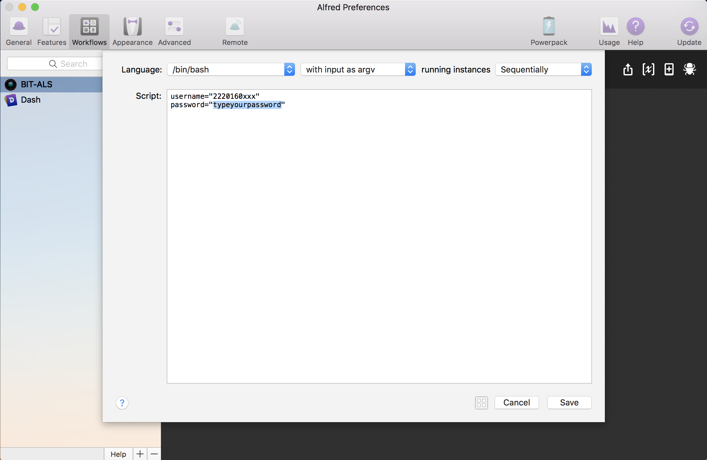

# BIT-Auto-Login-System
北理工（北京理工大学）校园网自动登录系统（ for Alfred with Mac），通过 Alfred 快速登录校园网！


# 特点
- 无需额外操作，无需额外安装 app，只需 Alfred Powerpack，当然如果没有 Alfred 那...exit
- 超快速，得益于 Alfred，任何页面呼出 Alfred 敲 `bit` 回车即可登录校园网
- 设备过载？呼出 Alfred 敲 `bit logout` 回车一键注销所有设备

# 安装方法
- （假设已安装 Alfred Powerpack，）下载本项目下 [BIT-ALS.alfredworkflow](https://github.com/zphhhhh/BIT-Auto-Login-System/raw/master/BIT-ALS.alfredworkflow)，双击它，即可导入 Alfred 工作流。
- 打开 Alfred - Preferences - Workflows ，进入工作流的 BIT-ALS 页面，点击第二步（即工作流图的中间一步），在弹出的页面中查看源代码，修改前两行，为自己的校园用户名和密码


# 使用方法
```
bit [option]

option:
    login   # 默认, 登录校园网
    logout  # 注销校园网，因为一些原因，目前的注销是指注销该用户下所有设备
```
例如：
```
bit         # 登录校园网  
bit login   # 登录校园网  
bit logout  # 注销校园网，因为一些原因，目前的注销是指注销该用户下所有设备
```

# 源代码
进入工作流的 BIT-ALS 页面，点击第二步（即工作流图的中间一步），在弹出的页面中，查看脚本源代码，下滑再下滑～

# 还要再快？？？
可结合 [ControlPlane](https://www.controlplaneapp.com/) ，在 Mac 开机或唤醒或翻起盖子时执行自动登录脚本。

# 关于
Github: https://github.com/zphhhhh/BIT-Auto-Login-System  
任何问题，请 @zphhhhh 在 Github，谢谢你！